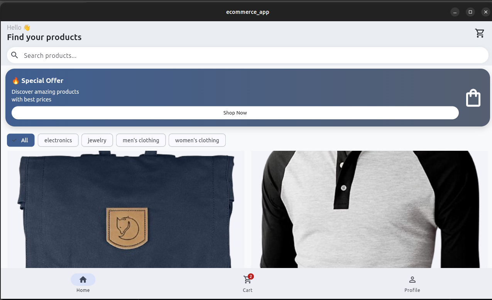
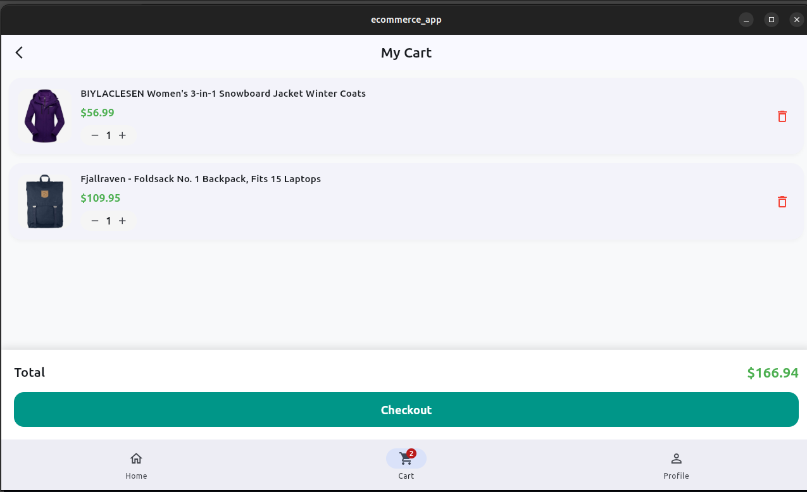
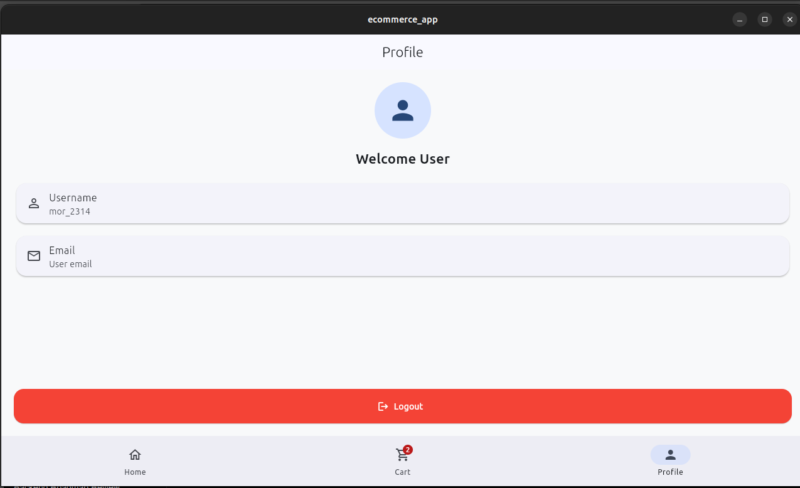

# 🛒 Ecommerce App Flutter

A modern Flutter E-Commerce mobile application built using **Fake Store API**, **Riverpod state management**, and **Clean Architecture principles**.

The application provides a complete shopping experience including authentication, product browsing, product details, shopping cart management, and user profile features.

---

# 📱 Screenshots

Here is a preview of the application:

| Homepage | Cart Page | Logout |
|:---:|:---:|:---:|
|  |  |  |

---

# ✨ Features

## 🔐 Authentication

- User login using Fake Store API
- Secure session persistence
- Automatic login detection
- Logout functionality
- Token storage using Shared Preferences

---

## 🛍️ Products

- Fetch products from Fake Store API
- Display products in modern grid layout
- Product details page
- Product rating display
- Category filtering
- Product search functionality
- Cached network images

---

## 🛒 Shopping Cart

- Add products to cart
- Increase product quantity
- Decrease product quantity
- Remove products
- Persistent cart storage
- Automatic total calculation

---

## 👤 Profile

- User profile section
- Display user information
- Logout support
- Session clearing

---

# 🎨 UI / UX

- Modern ecommerce design
- Responsive layouts
- Material 3 components
- Rounded product cards
- Gradient promotional banners
- Custom themes
- Loading states
- Error handling
- Clean user experience

---

# 🏗️ Architecture

The project follows **Clean Architecture principles**:


lib/

├── core/││ ├── network/│ │ ├── api_client.dart│ │ ├── dio_provider.dart│ │ └── interceptors/│ ││ ├── storage/│ │ └── local_storage_service.dart│ ││ └── theme/││├── features/││ ├── auth/│ ││ │ ├── data/│ │ │ ├── models/│ │ │ ├── repositories/│ │ │ └── data_sources/│ │ ││ │ ├── domain/│ │ │ └── repositories/│ │ ││ │ └── presentation/│ │ ├── providers/│ │ └── screens/│││ ├── products/│ ││ │ ├── data/│ │ ├── domain/│ │ └── presentation/│││ ├── cart/│ ││ │ ├── data/│ │ └── presentation/│││ ├── profile/│ ││ └── navigation/││└── routes/


---

# 🛠️ Technologies Used

## Frontend

- Flutter
- Dart
- Material Design 3

## State Management

- Riverpod

## Networking

- Dio
- REST API

## Storage

- Shared Preferences

## Navigation

- Go Router

## Image Handling

- Cached Network Image

## Code Generation

- json_serializable
- build_runner

---

# 🌐 API

This application uses:

Fake Store API


https://fakestoreapi.com


## Used Endpoints


POST /auth/login

GET /products

GET /products/categories

GET /products/category/{category}

GET /products/{id}

GET /users/{id}


---

# 📦 Main Dependencies

```yaml
flutter_riverpod:
dio:
shared_preferences:
go_router:
cached_network_image:
equatable:
json_annotation:


Development dependencies:

build_runner:
json_serializable:
flutter_lints:


🚀 Getting Started

Requirements

Before running this project, install:

Flutter SDK

Dart SDK

Android Studio or VS Code

Installation

Clone repository:

git clone https://github.com/Kumala-Adugna/Ecommerce_app.git


Move into project:

cd Ecommerce_app


Install packages:

flutter pub get


Generate files:

dart run build_runner build --delete-conflicting-outputs


Run application:

flutter run


🧪 Testing

Analyze project:

flutter analyze


Expected result:

No issues found!


📂 Project Status

Completed:

✅ Authentication✅ Login system✅ Session persistence✅ Product listing✅ Product details✅ Category filtering✅ Search functionality✅ Shopping cart✅ Cart persistence✅ Profile page✅ Logout functionality

📌 Future Improvements

Payment integration

Order history

Product favorites

Push notifications

Dark mode

Advanced animations

Backend integration

Online payment gateway

Recommendation system

👨‍💻 Developer

Kumala Adugna

Computer Science and Engineering StudentFlutter Developer

GitHub:

https://github.com/Kumala-Adugna


📄 License

This project is developed for educational and portfolio purposes.

